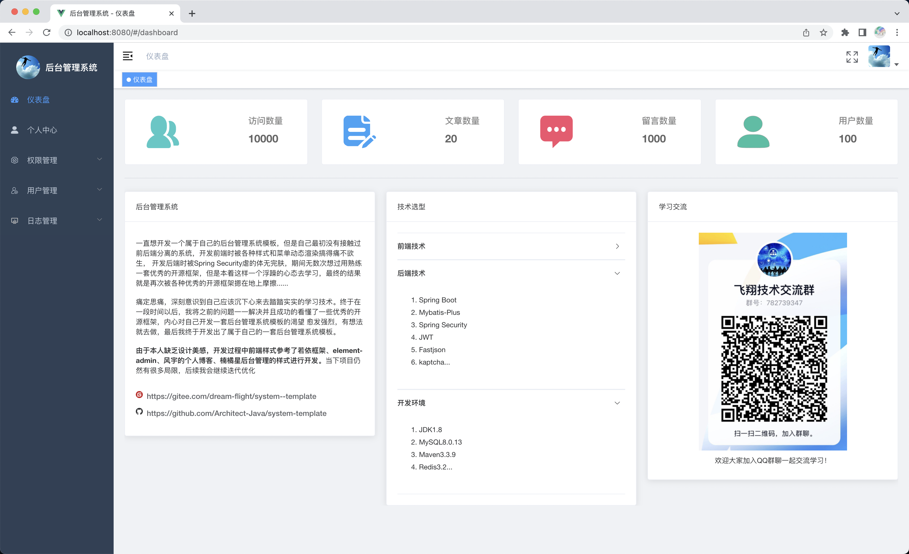
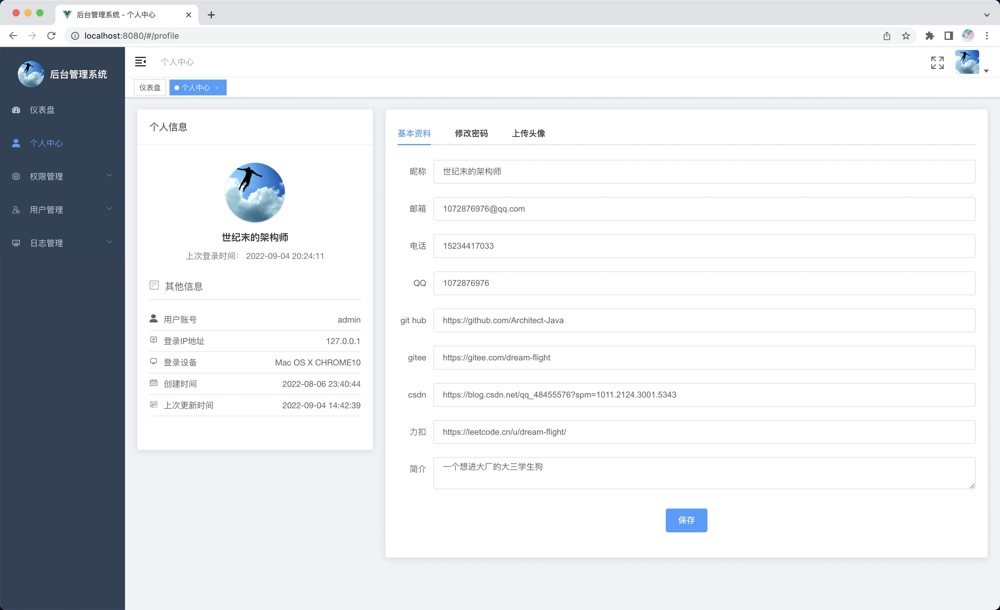
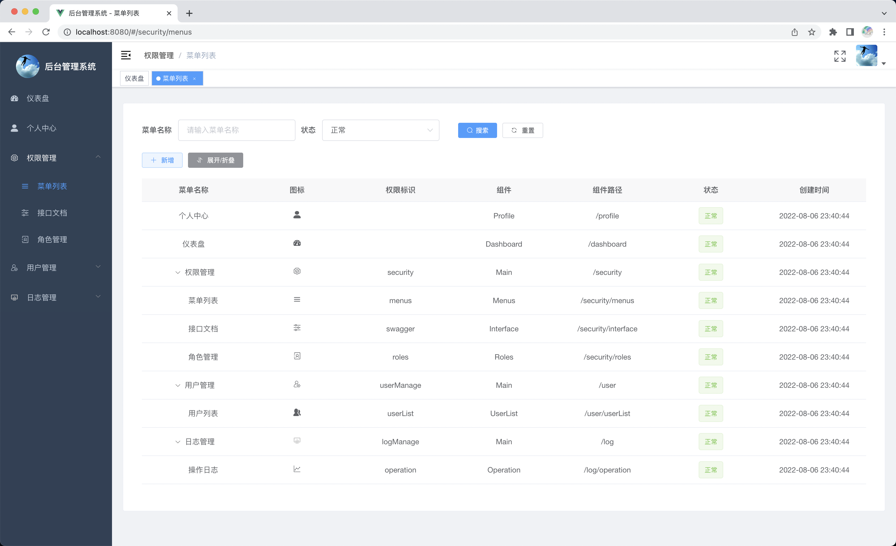
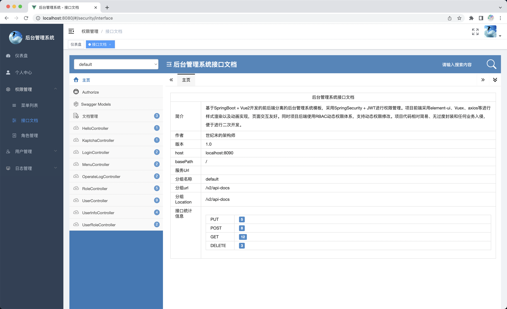
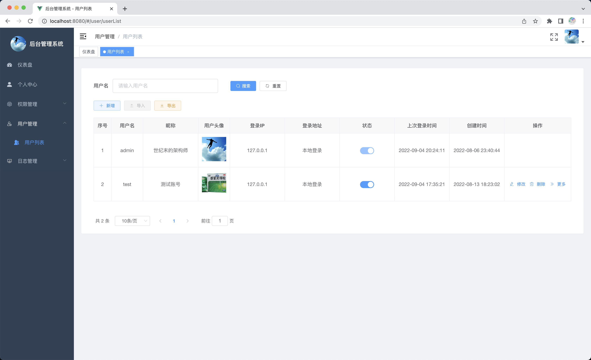
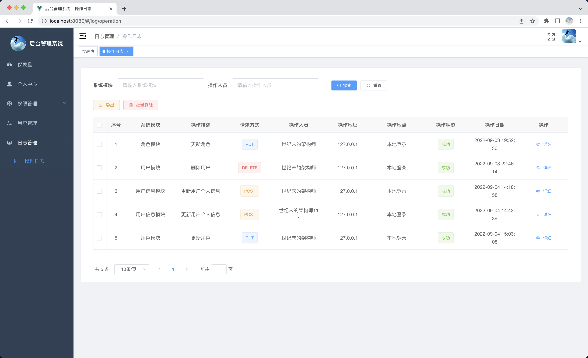
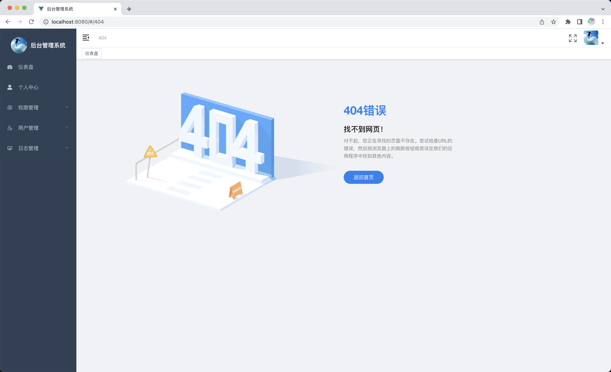
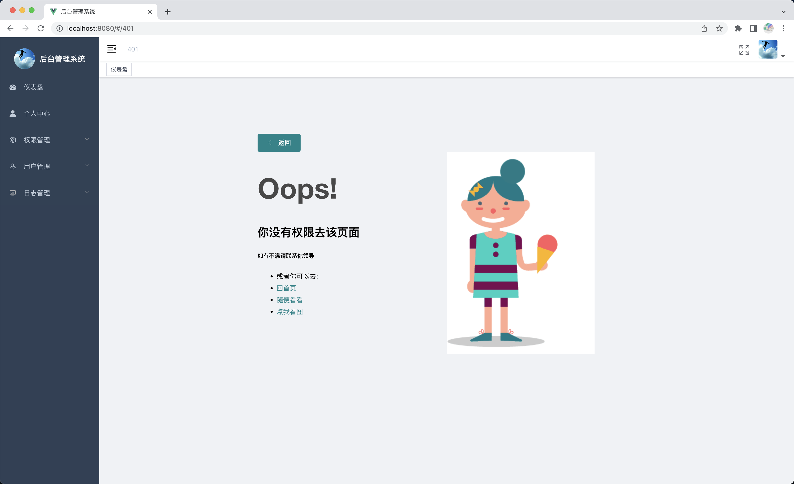

# 项目介绍

<div align="center">
  

    
  <span>**基于SpringBoot + Vue开发的后台管理系统模板**</span>  
              

</div>

## 前言

> 像若依框架中的描述那样，我也一直想开发一个属于自己的后台管理系统模板，但是自己最初没有接触过前后端分离的系统，开发前端时被各种样式和菜单动态渲染搞得痛不欲生， 开发后端时被Spring Security虐的体无完肤，期间无数次想过用熟练一套优秀的开源框架，但是本着这样一个浮躁的心态去学习，最终的结果就是再次被各种优秀的开源框架摁在地上摩擦......
>
> 痛定思痛，深刻意识到自己应该沉下心来去踏踏实实的学习技术。终于在一段时间以后，我将之前的问题一一解决并且成功的看懂了一些优秀的开源框架，内心对自己开发一套后台管理系统模板的渴望 愈发强烈，有想法就去做，最后我终于开发出了属于自己的一套后台管理系统模板。
>
> 开发完成后，深刻的意识到只是开发完成实现相应的基本功能是远远不够的，系统在遇到高并发、多用户访问时的各种情况处理使我明白，万里长征我现在只是跨出了第一步。后续我会持续进行优化迭代，您的star就是我的动力❤️

## 项目地址

**Github地址：** https://github.com/Architect-Java/system-template

**Gitee地址：** https://gitee.com/dream-flight/system--template

管理员账号：admin	密码：123456

测试账号：test	密码：1234567

## 目录结构

前端项目位于`system-vue`目录

后端项目位于`system-springboot`目录

SQL文件为根目录的`system-mysql8.sql`文件，需要MySQL8及以上的版本

**前端项目：**

```shell
system-vue
├── public   
├── api                -- api请求接口目录
├── assets             -- 静态资源
├── components         -- 全局组件
├── constant           -- 全局常量
├── filter             -- 过滤器
├── icons              -- svg图标
├── layout             -- 布局目录
├── router             -- 路由
├── store              -- 全局缓存
├── styles             -- scss样式目录
├── utils              -- 工具目录
├── views              -- 页面视图
├── App.vue            -- App.vue
├── main.js            -- main.js
└── permission.js      -- 路由导航守卫  
```

**后端项目**

```shell
system-springboot
├── annotation         --  自定义注解
├── aspect             --  aop切面
├── config             --  配置模块
├── constant           --  静态常量模块
├── controller         --  控制器模块
├── dto                --  dto模块
├── entity             --  实体类模块
├── enums              --  枚举模块
├── filters    	       --  过滤器模块
├── generator	       --  逆向工程模块
├── handler            --  处理器模块（自定义JWT权限过滤器）
├── mapper             --  数据持久化模块
├── service            --  业务处理模块
├── util               --  工具类模块
└── vo        	       --  vo模块
```

**项目运行：**

拉取项目到本地后，在数据库中直接运行`system-mysql8.sql`文件即可，数据库会自动创建好并导入数据。接着需要修改项目配置类中相应的参数信息。接着在前端项目中执行`npm install`方法下载前端项目对应的依赖后项目即可成功启动。

项目启动成功后输入管理员账号：admin	密码：123456进行登录即可进入系统

本地接口文档地址：http://localhost:8090/doc.html

**注意：**先启动后端项目，再启动前端项目，前端项目很多数据以及配置由后端动态加载

## 项目特点

- 前端样式参考"若依框架"、"element-admin"、"风宇的个人博客"、"楠橘星后台管理"进行设计
- 使用"element-ui"进行样式渲染，重写部分"element-ui"样式源码，侧边栏、面包屑导航自动生成
- 采用RBAC模型，支持动态权限分配，前端菜单与后台权限实时更新
- 项目前后端分离开发，适应当前潮流
- 页面切换采用了NProgress进行过渡，增加项目美观程度
- 使用Spring AOP自定义注解实现日志管理
- 集成Mybatis-Plus代码生成器，简化后续开发
- 前端代码层次简单，没有进行严重封装，便于后端开发者阅读与扩展开发
- 后端代码编写遵循阿里巴巴开发规范，利于开发者学习
- 项目仅完成后台管理系统最基本功能，无任何业务侵入，利于二次开发

## 开发环境

| 开发工具 | 功能作用      |
| -------- | ------------- |
| Idea     | Java开发工具  |
| Navicat  | MySQL连接工具 |
| VSCode   | Vue开发工具   |
| Medis    | Redis连接工具 |

| 开发环境 | 版本   |
| -------- | ------ |
| JDK      | 1.8    |
| MySQL    | 8.0.13 |
| Vue      | 2.6.11 |
| Redis    | 6.0.5  |

## 项目截图



















## 项目总结

一直记得我第一个完整开发的Web项目是大二给学校开发的评奖评优管理系统，还记得那时的Layui官网还没有下线，jQuery仍然占据着一片天。对于新手来说，后台管理系统模板还是比较容易上手的，在集成了Mybatis-Plus代码生成器后开发难度进一步下降，适合初学者学习开发以及复现，个人认为难点更多在于前端样式的手动实现与搭建。项目中的不足之处还请大家见谅，有问题和好的建议也欢迎大家私聊我，也欢迎大家加入群聊当中，我们相互鼓励、一起探讨、共同进步，与大家共勉！

## 交流群

